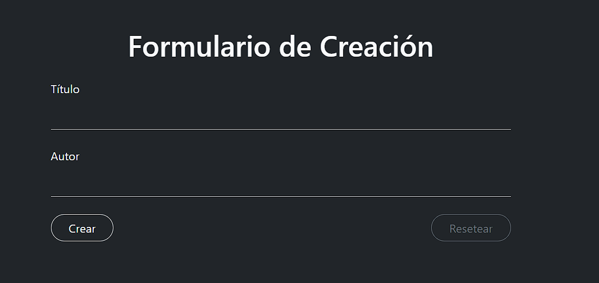
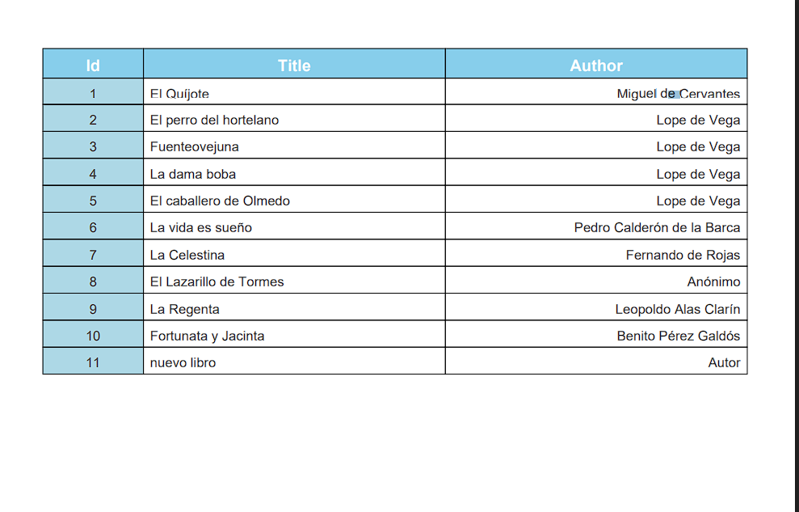
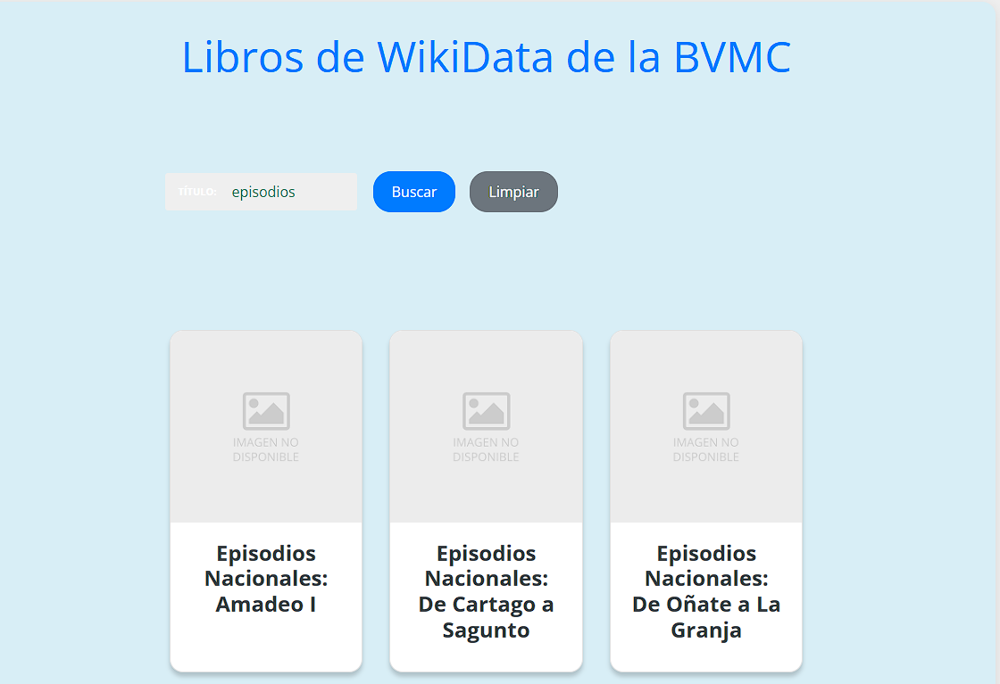

# Autores
Pedro Vázquez Tévar.

Jorge Bernabeu Caballero.


# Proyecto biblioteca de Spring Boot en version 3.4.2

Este proyecto se ha creado para la asignatura [Tecnologías de Internet Orientadas al Navegador del Máster Universitario en Desarrollo de Aplicaciones y Servicios Web de la Universidad de Alicante](https://cvnet.cpd.ua.es/Guia-Docente/?wcodasi=38215&wlengua=es&scaca=2024-25).

Para poder editar el código es posible installar un IDE como [Eclipse](https://www.eclipse.org) o [Idea](https://www.jetbrains.com/es-es/idea/). 

## Configuración
En el fichero ```src/main/resources/application.properties``` se puede configurar el acceso a la base de datos mysql para el almacenamiento de los libros del catálogo. También se puede configurar el puerto para ejecutar la aplicación.

El proyecto incluye la [librería Jena](https://jena.apache.org) como dependencia en el fichero ```pom.xml``` para el uso de SPARQL.

El fichero ```pom.xml``` incluye las versiones de las librerías utilizadas en este proyecto.

## API REST

El proyecto proporciona los siguientes patrones de URL para dar acceso al API REST:

- Crear libro (POST): localhost:8081/api/book
- Modificar libro (UPDATE): localhost:8081/api/book/{ID}
- Eliminar libro (DELETE): localhost:8081/api/book/{ID}
- Recuperar libro (GET): localhost:8081/api/book/{ID}

Para poder realizar pruebas se puede utilizar la herramienta [Postman](https://www.postman.com/)

## URLs de otros servicios
- Generar fichero PDF con el listado de obras: localhost:8081/api/pdfreport
- Consulta autores de la [Biblioteca Virtual Miguel de Cervantes](https://www.cervantesvirtual.com/) al repositorio [Wikidata](https://query.wikidata.org/): localhost:8081/api/authorsbvmc

## Vistas Thymeleaf
Las vistas Thymeleaf que proporciona la aplicación a través del controlador *ControllerTM* son las siguientes:

- Listado de libros: localhost:8081/books
- Formulario para crear un libro: localhost:8081/createBook
- Búsqueda: localhost:8081/searchBook

Todas las vistas se comunican con la capa de servicios que proporciona el proyecto.

## Acceso a Wikidata
El proyecto proporciona un servicio para recuperar información de Wikidata. Se utiliza la [siguiente sentencia SPARQL](https://w.wiki/9F33):

```
PREFIX wdt: <http://www.wikidata.org/prop/direct/> 
PREFIX wikibase: <http://wikiba.se/ontology#> 
PREFIX bd: <http://www.bigdata.com/rdf#> 
PREFIX rdfs: <http://www.w3.org/2000/01/rdf-schema#> 

SELECT ?obra (SAMPLE(?obraLabel) AS ?titulo) (SAMPLE(?fechaPublicacion) AS ?fecha) 
       ?autor (SAMPLE(?autorLabel) AS ?autorNombre) (SAMPLE(?imagen) AS ?imagenEjemplo) 
WHERE { 
   SERVICE <https://query.wikidata.org/sparql> { 
      ?obra wdt:P3976 ?bvmcWorkID. 
      ?obra wdt:P50 ?autor. 
      ?autor wdt:P2799 ?bvmcPersonID. 
      ?obra wdt:P577 ?fechaPublicacion. 
      ?obra rdfs:label ?obraLabel. 
      OPTIONAL { ?obra wdt:P18 ?imagen. } 
      FILTER(CONTAINS(LCASE(?obraLabel), "NOMBRE_DEL_LIBRO"))  # Sustituir "NOMBRE_DEL_LIBRO" dinámicamente
      SERVICE wikibase:label { bd:serviceParam wikibase:language "es" } 
   } 
} 
GROUP BY ?obra ?autor 
ORDER BY ?titulo 
LIMIT 50

```

## Posibles mejoras para el proyecto

- Añadir CSS a las plantillas de Thymeleaf
- Añadir nuevas vistas Thymeleaf
- Añadir nuevas propiedades a la entidad libro (enlaces externo, fecha publicación, notas sobre la obra, portada)
- Añadir el identificador al listado de libros
- Proporcionar un botón en una vista Thymeleaf que realice la llamada al servicio de generación de fichero pdf (localhost:8081/api/pdfreport)
- Modificar el formulario de búsqueda para poder buscar por otros atributos (p.ej. nombre del autor)
- Ofrecer la posibilidad de borrar libros desde los listados
- Modificar el aspecto del fichero PDF con el listado de obras: localhost:8081/api/pdfreport
- Parametrizar número de resultados de la sentencia SPARQL
- Modificar la sentencia SPARQL para recuperar otro tipo de contenido a partir del repositorio de Wikidata. Para ello podéis consultar información sobre cómo [crear consultas SPARQL](https://data.cervantesvirtual.com/noticia/tutorial-de-inicio-a-sparql), [ejemplos de Wikidata](https://www.wikidata.org/wiki/Wikidata:SPARQL_query_service/queries/examples/es) y [otras iniciativas](https://github.com/hibernator11/hdh-compartir-pantalla-2023).
- Crear una vista Thymeleaf para mostrar los resultados de la llamada a Wikidata (localhost:8081/api/authorsbvmc)
- Añadir sistema de login con usuarios







## Licencia y términos de uso
<a rel="license" href="http://creativecommons.org/licenses/by/4.0/"></a><br />Esta obra está bajo una <a rel="license" href="http://creativecommons.org/licenses/by/4.0/">Licencia Creative Commons Atribución 4.0 Internacional</a>.


